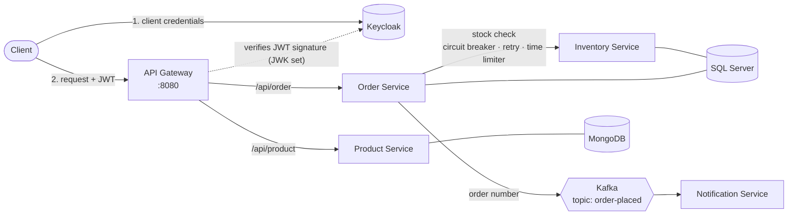

# Spring Boot E-commerce Microservices

[](https://github.com/AkashBhuyar7/spring-boot-ecommerce-microservices/actions/workflows/ci.yml)

A small e-commerce backend built as Spring Boot microservices: a product catalog, inventory, orders and notifications behind an API gateway secured with Keycloak.

The project demonstrates:

- **Service discovery** with Netflix Eureka and client-side load balancing
- **An API gateway** (Spring Cloud Gateway) that validates **OAuth2 / JWT** access tokens issued by **Keycloak**
- **Resilience** for service-to-service calls with Resilience4j (circuit breaker, retry, time limiter)
- **Event-driven messaging** with Apache Kafka
- **Distributed tracing** with Micrometer Tracing and Zipkin
- Polyglot persistence with **MongoDB** and **SQL Server**
- Tests with JUnit 5, Mockito, **Testcontainers** and embedded Kafka, plus a one-command **Docker Compose** setup

## Architecture



Every service registers with the **Eureka discovery server** (port 8761), which the gateway and order-service use to find instances, and sends traces to **Zipkin**.

### Services

| Service | Port | Responsibility | Storage |
|---|---|---|---|
| `discovery-server` | 8761 | Eureka service registry and dashboard | - |
| `api-gateway` | 8080 | Single entry point. Validates the Keycloak JWT and routes `/api/product` and `/api/order` | - |
| `product-service` | random | Create and list products | MongoDB |
| `inventory-service` | 8082 | Reports whether SKUs are in stock (internal, not exposed through the gateway) | SQL Server `inventory_service` |
| `order-service` | 8081 | Places orders after an inventory check and publishes an `order-placed` event | SQL Server `order_service` |
| `notification-service` | 8085 | Consumes `order-placed` events and logs a notification | - |

### How an order is placed

1. The client gets an access token from Keycloak and calls `POST /api/order` on the gateway.
2. The gateway validates the token and forwards the request to an `order-service` instance found through Eureka.
3. `order-service` validates the request, then asks `inventory-service` whether every SKU is in stock.
4. If any SKU is unknown or out of stock, the order is rejected with **409 Conflict**.
5. Otherwise the order is saved to SQL Server and its order number is published to the Kafka topic `order-placed`.
6. `notification-service` consumes the event and logs the notification.

### Resilience

Only the inventory lookup in `order-service` ([`InventoryClient`](order-service/src/main/java/com/micro/orderservice/client/InventoryClient.java)) is wrapped by Resilience4j. Because it is a read-only call, retrying it can never create duplicate orders.

- **Time limiter:** each attempt times out after 3 seconds.
- **Retry:** up to 3 attempts, 1 second apart.
- **Circuit breaker:** opens when 50% of the last 5 calls fail, and tries again after 5 seconds.
- **Fallback:** if inventory-service still can't be reached, the API answers **503 Service Unavailable** instead of hanging or returning a misleading success. If inventory-service does not answer at all, this takes about 11 seconds in the worst case: 3 attempts of 3 seconds plus two 1-second waits. While the circuit is open, requests fail within about 2 seconds.

Circuit-breaker state and recent events are available on order-service at `/actuator/circuitbreakers` and `/actuator/circuitbreakerevents`. When running from the IDE, that is http://localhost:8081/actuator/circuitbreakers.

## Tech stack

| Area | Technology |
|---|---|
| Language and framework | Java 17, Spring Boot 4.0, Spring Cloud 2025.1 |
| Gateway and discovery | Spring Cloud Gateway Server Web MVC, Netflix Eureka, Spring Cloud LoadBalancer |
| Security | Keycloak 26, Spring Security OAuth2 Resource Server (JWT) |
| Resilience | Resilience4j |
| Messaging | Apache Kafka 4.1 (KRaft mode) |
| Persistence | MongoDB 7 (Spring Data MongoDB), SQL Server 2022 (Spring Data JPA / Hibernate) |
| Observability | Micrometer Tracing (Brave), Zipkin, Spring Boot Actuator, Kafka UI |
| Testing | JUnit 5, Mockito, MockMvc, Testcontainers, Embedded Kafka |
| Build and run | Maven (wrapper included), Docker, Docker Compose, GitHub Actions |

## Getting started

### Prerequisites

- **Docker Desktop** (or Docker Engine with Compose v2) with at least **8 GB of memory** available to Docker
- **JDK 17 or newer**, only needed to run the tests or to run the services outside Docker

### Run everything with Docker

```bash
git clone https://github.com/AkashBhuyar7/spring-boot-ecommerce-microservices.git
cd spring-boot-ecommerce-microservices
cp .env.example .env        # optional: change the local passwords
docker compose up -d --build
```

The first build downloads the images and Maven dependencies and takes a few minutes. When `docker compose ps` shows every service as running, open the Eureka dashboard at http://localhost:8761. Wait until all five client services are registered (this takes up to about 30 seconds) before sending requests.

To stop everything, run `docker compose down`. Add `-v` to also delete the MongoDB and SQL Server data.

### Run the services from your IDE

Start only the infrastructure in Docker:

```bash
docker compose up -d kafka kafka-ui keycloak zipkin mongodb sqlserver sqlserver-init
```

Then start `discovery-server` first, followed by the other services, either from your IDE (run each `*Application` class) or with Maven:

```bash
./mvnw -pl discovery-server spring-boot:run
./mvnw -pl api-gateway spring-boot:run
# ...and so on for product-service, inventory-service, order-service and notification-service
```

On Windows, use `mvnw.cmd` instead of `./mvnw`. The defaults in each `application.properties` point to `localhost`, so no extra configuration is needed.

## Using the API

All requests go through the gateway at `http://localhost:8080` and need an access token.

### 1. Get an access token

The realm `spring-boot-microservices-realm` and the client `spring-cloud-client` are imported automatically when Keycloak starts ([`keycloak/realm-export.json`](keycloak/realm-export.json)). The client secret is for local development only.

```bash
TOKEN=$(curl -s -X POST http://localhost:8181/realms/spring-boot-microservices-realm/protocol/openid-connect/token \
  -d grant_type=client_credentials \
  -d client_id=spring-cloud-client \
  -d client_secret=spring-cloud-client-dev-secret | jq -r .access_token)
```

PowerShell:

```powershell
$TOKEN = (Invoke-RestMethod -Method Post `
  -Uri http://localhost:8181/realms/spring-boot-microservices-realm/protocol/openid-connect/token `
  -Body @{ grant_type = 'client_credentials'; client_id = 'spring-cloud-client'; client_secret = 'spring-cloud-client-dev-secret' }).access_token
```

Tokens are valid for 15 minutes. Requests without a valid token get **401 Unauthorized**.

### 2. Products

```bash
# Create a product -> 201 Created
curl -i -X POST http://localhost:8080/api/product \
  -H "Authorization: Bearer $TOKEN" -H "Content-Type: application/json" \
  -d '{"name": "iPhone 13", "description": "Apple iPhone 13", "price": 1200}'

# List products -> 200 OK
curl -H "Authorization: Bearer $TOKEN" http://localhost:8080/api/product
```

A product needs a non-blank `name` and a positive `price`; anything else gets **400 Bad Request**.

### 3. Orders

inventory-service starts with this sample stock:

| SKU | Quantity | In stock |
|---|---|---|
| `iphone_13` | 100 | yes |
| `iphone_13_red` | 0 | no |

```bash
curl -i -X POST http://localhost:8080/api/order \
  -H "Authorization: Bearer $TOKEN" -H "Content-Type: application/json" \
  -d '{"orderLineItemsDtoList": [{"skuCode": "iphone_13", "price": 1200, "quantity": 1}]}'
```

| Situation | Response |
|---|---|
| Every SKU is in stock | **201 Created** with `{"orderNumber": "...", "message": "Order placed successfully"}` |
| A SKU is out of stock or unknown (e.g. `iphone_13_red`) | **409 Conflict**, with the SKUs listed in `skuCodes` |
| No line items, blank SKU, or price/quantity not positive | **400 Bad Request** |
| inventory-service is down or too slow | **503 Service Unavailable** (after retries) |

Error responses use the standard [Problem Details](https://www.rfc-editor.org/rfc/rfc9457) format:

```json
{
  "detail": "Products not in stock: iphone_13_red",
  "instance": "/api/order",
  "status": 409,
  "title": "Product not in stock",
  "skuCodes": ["iphone_13_red"]
}
```

After a successful order, the notification shows up in the notification-service log:

```bash
docker compose logs notification-service | grep "sending notification"
```

## Dashboards

| Tool | URL | Notes |
|---|---|---|
| Eureka | http://localhost:8761 | Also available through the gateway at http://localhost:8080/eureka/web |
| Zipkin | http://localhost:9411 | One trace per request: api-gateway → order-service → inventory-service → notification-service |
| Kafka UI | http://localhost:9091 | Browse the `order-placed` topic and its messages |
| Keycloak admin console | http://localhost:8181 | `admin` / `admin` unless changed in `.env` |

## Configuration

Each service reads its connection settings from environment variables, and falls back to `localhost` defaults for local runs. Docker Compose sets them for the containers.

| Variable | Used by | Default |
|---|---|---|
| `EUREKA_URL` | all Eureka clients | `http://localhost:8761/eureka` |
| `EUREKA_INSTANCE_HOSTNAME` | all services | `localhost` |
| `EUREKA_PREFER_IP_ADDRESS` | all Eureka clients | `false` (Compose sets `true`) |
| `ZIPKIN_URL` | all services | `http://localhost:9411/api/v2/spans` |
| `KEYCLOAK_ISSUER_URI` | api-gateway | `http://localhost:8181/realms/spring-boot-microservices-realm` |
| `KEYCLOAK_JWK_SET_URI` | api-gateway | `<issuer>/protocol/openid-connect/certs` |
| `EUREKA_DASHBOARD_URL` | api-gateway | `http://localhost:8761` |
| `MONGODB_URI` | product-service | `mongodb://localhost:27017/product-service` |
| `SQLSERVER_HOST` | inventory-service, order-service | `localhost` |
| `DB_USERNAME` / `DB_PASSWORD` | inventory-service, order-service | `sa` / `LocalDev_Passw0rd` |
| `KAFKA_BOOTSTRAP_SERVERS` | order-service, notification-service | `localhost:9092` |

The Docker Compose credentials (`MSSQL_SA_PASSWORD`, `KEYCLOAK_ADMIN_USERNAME`, `KEYCLOAK_ADMIN_PASSWORD`) can be changed in `.env`; see [`.env.example`](.env.example). All bundled credentials are for local development only.

## Running the tests

```bash
./mvnw verify
```

Docker must be running, because the integration tests start MongoDB and SQL Server with Testcontainers. The same command runs in GitHub Actions on every push and pull request.

| Module | What is tested |
|---|---|
| discovery-server | The application context starts |
| api-gateway | Requests without a token get 401; requests with a JWT, and the Eureka dashboard, are routed |
| product-service | Create, list and validation against a real MongoDB (Testcontainers) |
| inventory-service | Stock logic (unit), JSON contract (`@WebMvcTest`), and seeded data against a real SQL Server (Testcontainers) |
| order-service | Order rules (unit), HTTP status codes (`@WebMvcTest`), and the retry and fallback chain against a real SQL Server (Testcontainers) |
| notification-service | An `order-placed` event is consumed (embedded Kafka) |

## Project structure

```
.
├── discovery-server/        Eureka server
├── api-gateway/             Gateway routes and JWT security
├── product-service/         Products (MongoDB)
├── inventory-service/       Stock lookup (SQL Server)
├── order-service/           Orders, inventory client with Resilience4j, Kafka producer
├── notification-service/    Kafka consumer
├── keycloak/                Realm imported into Keycloak on startup
├── sqlserver/               Script that creates the SQL Server databases
├── Dockerfile               Builds any service: --build-arg MODULE=<service>
├── docker-compose.yaml      Infrastructure and all services
└── pom.xml                  Maven parent (Spring Boot and Spring Cloud versions)
```

## Troubleshooting

- **A port is already in use.** The stack publishes 1433, 8080, 8181, 8761, 9091, 9092, 9411 and 27017. Stop whatever is using the port (for example a local SQL Server or MongoDB installation).
- **The gateway returns 503 right after startup.** Services need up to about 30 seconds to register with Eureka and for the gateway to see them. Check http://localhost:8761 and try again. The gateway also answers 503 when a service behind it is stopped.
- **401 with a token you just requested.** The token must be requested from `http://localhost:8181`, so that its issuer matches the gateway configuration. Tokens also expire after 15 minutes.
- **SQL Server does not start.** It needs about 2 GB of memory, and `MSSQL_SA_PASSWORD` must be at least 8 characters from three of: uppercase, lowercase, digits, symbols. Check `docker compose logs sqlserver`.
- **Apple Silicon Macs.** The SQL Server image is built for x86-64. Enable "Use Rosetta for x86/amd64 emulation" in Docker Desktop settings.

## Screenshots

<!-- Add screenshots of the Eureka dashboard, a Zipkin trace and Kafka UI here, for example:

-->

## License

This project is licensed under the [MIT License](LICENSE).
